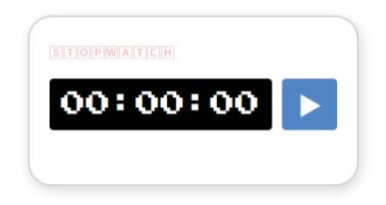
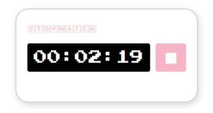

# HTML + CSS + 자바스크립트 [ : 놀이터 ]

이 프로젝트는 프론트엔드 개발 역량을 향상시키기 위해 기획되었습니다. HTML, CSS, JavaScript와 같은 기본 웹 기술을 활용하여 사용자 인터페이스(UI)를 구현하고, React, Vue, Angular 등 최신 프레임워크의 사용법을 익히는 데 중점을 두고 있습니다. 또한, 반응형 웹 디자인, 상태 관리, API 연동 등의 실무 기술을 경험하며 프론트엔드 개발자로서의 실전 감각을 기르는 것을 목표로 합니다. 프로젝트를 진행하면서 문제 해결 능력과 코드 작성 능력을 함께 발전시키고자 합니다.

## 사용기술

- HTML
- CSS
- Javascript

---

## Day1 : stopwatch 스탑워치

### Day1 주요기능

1.시작 (Start)
사용자가 '시작' 버튼을 누르면 스톱워치가 1초 단위로 시간을 측정하기 시작합니다.

2.일시정지 (Pause)
'일시정지' 버튼을 누르면 현재까지 측정된 시간이 멈추고, 다시 '시작'을 누르면 이어서 측정이 계속됩니다.

3.초기화 (Reset)
'초기화' 버튼을 누르면 측정 중이던 시간과 기록이 모두 0으로 리셋되어 스톱워치를 처음 상태로 되돌립니다.

---

##### 참고 저서

- 얄코의 TOO MUCH 친절한 HTML + CSS + 자바스크립트
